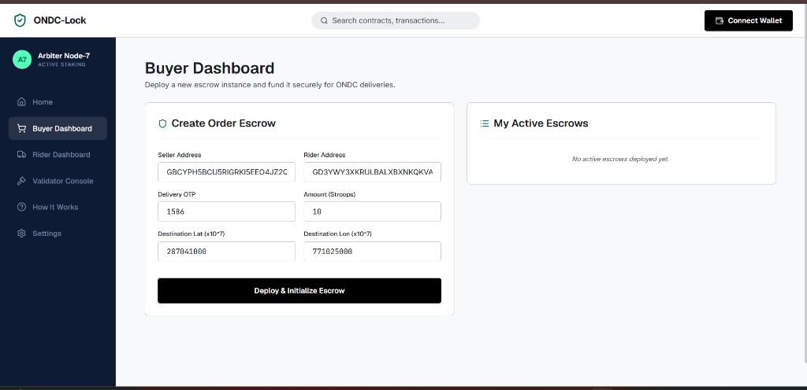
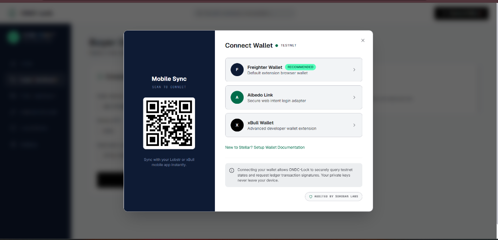
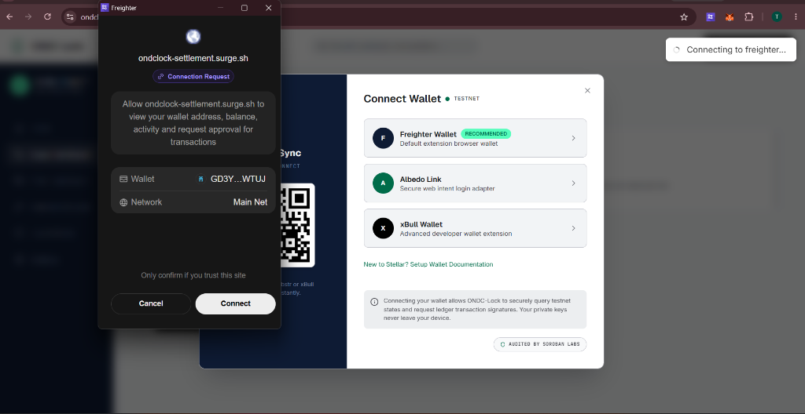
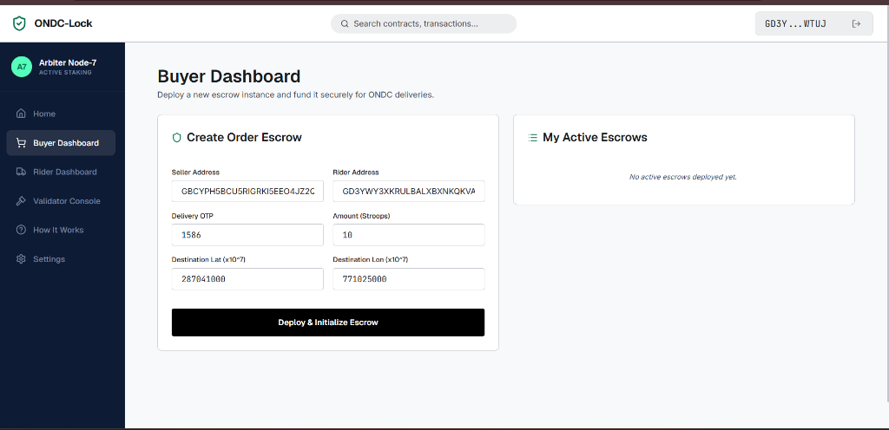

# ONDC-Lock 🔒 — Decentralized Escrow & Dispute Resolution Layer

ONDC-Lock is a decentralized escrow and dispute-resolution settlement layer designed for India's Open Network for Digital Commerce (ONDC). Built on the **Stellar/Soroban testnet**, it ensures trustless transaction settlement between buyers, sellers, logistics providers, and validators using automated smart contracts and fixed-point geofencing.

---

## 🚀 Live Demo & Links

* 🌐 **Production Web Link**: [https://ondclock-settlement.surge.sh](https://ondclock-settlement.surge.sh)
* 📱 **Mobile Responsive Link**: [https://ondclock-settlement.surge.sh](https://ondclock-settlement.surge.sh)

---

## 🖼️ Screenshots & Walkthrough

Here is the step-by-step wallet connection and onboarding flow of ONDC-Lock:

### 1. Buyer Dashboard (Logged Out State)
The dashboard displays locked order escrow parameters. Users are prompted to connect their Stellar wallet at the top right:


### 2. Stitch Custom Wallet Connection Modal
Clicking "Connect Wallet" opens our custom modal styled according to the Stitch design specifications (QR Mobile Sync on the left, Freighter/Albedo options on the right):


### 3. Freighter Wallet Connection Request Popup
Selecting Freighter initiates the extension trigger, asking the user to authorize connection to the ONDC-Lock application:


### 4. Buyer Dashboard (Connected State)
Once connected, the wallet address is securely queried, truncated, and displayed at the top right, enabling escrow deployment:


---

## 🛠️ Deployed Stellar Testnet Contracts

ONDC-Lock leverages a modular 5-contract microservice architecture. All contracts are currently deployed on the Stellar Testnet:

| Contract | Address / ID | Purpose |
| :--- | :--- | :--- |
| **ParticipantRegistry** | `CCTZQQJURSG6OL2WTPDBWSWXIYOW7MSHD7EZ4XW25H4UNO7CJIAYBOKA` | Manages ONDC BAP/BPP configuration (SLA profiles, commission rates) mapped to Stellar keys. |
| **ValidatorRegistry** | `CCL2JGIDNFXPLEKJ5N6LFIVYLP6YJJR7MTB653ZYIPKENYYEI6QQBV2T` | Manages Arbiter node registry, staking locks, reputation scores, and eligibility. |
| **DisputeRegistry** | `CB5JHSE4CQWUDXANNT6ZE7LM4QXCB7Y6VJ4XCC2UWRJRTDPBLZENEOE2` | Handles opening disputes, validator voting registries, and executing consensus rules. |
| **EscrowFactory** | `CAHJBEWY2DNJZBXXQUCITHDGIAA4DZDJDSRFS6UZO7WMJFNE26IXV4ME` | Deploys sandboxed `OrderEscrow` child contract instances dynamically using deterministic salts. |
| **OrderEscrow WASM Hash** | `99f38a862a977a767d1253b171432a9c5a7e4f1521714af8b233d16954478d7c` | The compiled WebAssembly bytecode deployed for child escrows. |

---

## 📐 Architecture & Contract Interactions

ONDC-Lock implements a sandboxed, factory-deployed architecture. This means each delivery order spawns its own isolated `OrderEscrow` contract instance, containing strictly defined participants, amounts, and rules.

```mermaid
sequenceDiagram
    autonumber
    actor Buyer
    actor Rider
    actor Validator
    participant EscrowFactory
    participant OrderEscrow
    participant DisputeRegistry
    participant ValidatorRegistry

    Buyer->>EscrowFactory: create_escrow(seller, rider, OTP_hash, amount, GPS_target)
    Note over EscrowFactory: Deploys new OrderEscrow<br/>using deploy_v2
    EscrowFactory->>OrderEscrow: initialize(buyer, seller, rider, amount, GPS_target, dispute_reg)
    Note over OrderEscrow: Locks buyer funds (XLM)
    
    rect rgb(30, 40, 50)
        Note over Rider, OrderEscrow: Standard Flow (Handover)
        Rider->>OrderEscrow: submit_proof(OTP, current_GPS)
        Note over OrderEscrow: Calculates distance.<br/>If within 50m tolerance:
        OrderEscrow-->>OrderEscrow: Release & Atomic Split
    end
    
    rect rgb(45, 30, 30)
        Note over Buyer, DisputeRegistry: Dispute Flow (Failure/Delay)
        Buyer->>DisputeRegistry: open_dispute(escrow_id, evidence_hash)
        Validator->>ValidatorRegistry: register_validator(stake_amount)
        Validator->>DisputeRegistry: cast_vote(dispute_id, vote_decision)
        Note over DisputeRegistry: Resolves once 3 concurrent<br/>votes match consensus
        DisputeRegistry->>OrderEscrow: execute_resolution(decision)
    end
```



### 1. Participant Registry
* **Purpose**: Registers ONDC actors (Buyers/BAPs, Sellers/BPPs, Logistics/BGPs).
* **Storage**: Maps addresses to a struct containing commissions, reputation metrics, and active SLA statuses.

### 2. Validator Registry
* **Purpose**: Registers independent Arbiter nodes who resolve network disputes.
* **Mechanism**: To qualify, validators must lock a minimum stake of testnet XLM. They start with a baseline reputation score of 100. If their score falls below 50 (due to voting against consensus or SLA timeouts), they are deactivated, and their locked stake is slashed.

### 3. Dispute Registry
* **Purpose**: Houses active dispute cases, compiles evidence, and tallies validator votes.
* **Consensus**: Implements a simple majority consensus pool (3 votes minimum) to declare case outcomes.

### 4. Order Escrow
* **Purpose**: An isolated contract holding the order payment. It acts as the core state machine for order settlement.
* **State Machine Transitions**:
  * `Funded / Active`: Contract initialized, holding buyer's funds.
  * `Settled`: Handover OTP and GPS coordinates verified on-chain. Funds split atomically.
  * `Disputed`: Settlement halted. Awaiting consensus voting results.
  * `Refunded`: Funds returned back to the buyer due to non-delivery.

### 5. Escrow Factory
* **Purpose**: Instantiates and initializes child `OrderEscrow` contracts.
* **Auth Design**: Factory requests `buyer.require_auth()` before deployment, then calls `initialize` on the child. The child does not need to run `require_auth` in its `initialize` routine, preventing dynamic address authorization VM trap errors.

---

## 🌍 On-Chain GPS Geofencing (Fixed-Point Math)

Since floating-point arithmetic is non-deterministic and prohibited in blockchain runtime environments like Soroban, ONDC-Lock implements a **fixed-point Haversine approximation** to verify distances on-chain.

* **Coordinate Representation**: Latitudes and longitudes are scaled by $10^7$ (e.g., Delhi coordinates `28.7041` Lat, `77.1025` Lon are stored as integers `287041000` and `771025000` respectively).
* **Tolerance Boundary**: Set to $10,000$ coordinate units, which equates to roughly **50–100 meters** depending on latitude.
* **On-Chain Formula**:
  $$\text{dist\_sq} = (\text{lat}_2 - \text{lat}_1)^2 + (\text{lon}_2 - \text{lon}_1)^2$$
  If $\text{dist\_sq} \le \text{tolerance}^2$, the rider is verified as physically present at the delivery target.

---

## 💸 Atomic Payout Split (Arithmetics)

When delivery is verified, the escrow contract releases the locked XLM using an atomic split mechanism to eliminate multi-party routing delays:
* **Seller Payout**: $95.0\%$ of the escrow amount.
* **Logistics Provider (Rider)**: $2.5\%$ of the escrow amount.
* **ONDC Platform / Protocol Fee**: $2.5\%$ of the escrow amount.

---

## 🎨 Stitch Design System Specifications

The frontend implements the **Stitch Design System** using Tailwind CSS v4 and vanilla CSS variables:

* **Surfaces**: Base elevation using `#f7f9fb` (Surface), Level 1 white border cards (`#ffffff` with 1px border), and Level 2 glassmorphic modals (`bg-white/80 backdrop-blur-xl`).
* **Branding**: Solid `#000000` primary buttons, dark navy `#0e1b34` primary containers (sidebar and hero background).
* **Timelines & Split Visualizations**: Built-in SVG lines that animate from dashed grey (pending) to solid green (settled) on successful payout release.
* **Status Badges**: Custom-colored pills representing states (Funded, Settled, Voting Open, Refunded).

---

## 📦 Project Structure

```text
├── contracts/             # Soroban Rust Smart Contracts
│   └── order_escrow/
│       ├── Cargo.toml     # Cargo workspace configurations
│       ├── contracts/
│       │   ├── dispute-registry/     # Dispute opening & validator vote tallies
│       │   ├── escrow-factory/       # Deploys individual escrows dynamically
│       │   ├── order-escrow/         # Geofencing, OTP, and splits state machine
│       │   ├── participant-registry/  # SLA and commissions mappings
│       │   └── validator-registry/   # Staking & reputation controls
│       └── tests/
│           └── order-escrow/         # Rust contract unit tests
├── frontend/              # React, Vite, TS, Tailwind CSS v4 Web App
│   ├── src/components/    # BlockchainString (copyable), StatusPill, SplitVisualizer
│   ├── src/context/       # FreighterContext wrapping StellarWalletsKit
│   ├── src/hooks/         # useTheme dark mode and density scaling hook
│   └── src/pages/         # Buyer, Rider, Validator, Settings, HowItWorks, and Home
└── .github/workflows/     # CI GitHub Actions for build checks
```

---

## 💻 Local Setup & Development

### Prerequisite installations:
* Rust toolchain (version 1.84.0+ recommended for `wasm32v1-none`)
* Node.js (version 18+)
* Stellar CLI (version 25.2.0+)

### 1. Build and Test Smart Contracts
Run checks and compiles in the cargo workspace:
```bash
# Go to contracts folder
cd contracts/order_escrow

# Run Cargo contract unit tests
cargo test

# Compile contracts to target Wasm
cargo build --target wasm32v1-none --release
```

### 2. Deploy Smart Contracts to Testnet
```bash
# Setup identities
stellar keys generate --global deployer
stellar keys generate --global admin

# Deploy the child OrderEscrow WASM bytecode
stellar contract install --network testnet --source deployer --wasm target/wasm32v1-none/release/order_escrow.wasm
# Save the resulting WASM Hash (e.g. 99f38a86...)

# Deploy the EscrowFactory instance
stellar contract deploy --network testnet --source deployer --wasm target/wasm32v1-none/release/escrow_factory.wasm
# Save the resulting Contract ID (e.g. CAHJBE...)

# Initialize the factory with your WASM hash and participant registry
stellar contract invoke --network testnet --source admin --id <FACTORY_CONTRACT_ID> -- initialize --admin <ADMIN_ADDRESS> --escrow_wasm_hash <WASM_HASH> --participant_registry <REGISTRY_CONTRACT_ID>
```

### 3. Setup and Run the Frontend
Configure the environment variables in `frontend/.env`:
```env
VITE_STELLAR_NETWORK_PASSPHRASE="Test SDF Network ; September 2015"
VITE_HORIZON_URL="https://horizon-testnet.stellar.org"
VITE_SOROBAN_RPC_URL="https://soroban-testnet.stellar.org"
VITE_PARTICIPANT_REGISTRY="CCTZQQJURSG6OL2WTPDBWSWXIYOW7MSHD7EZ4XW25H4UNO7CJIAYBOKA"
VITE_VALIDATOR_REGISTRY="CCL2JGIDNFXPLEKJ5N6LFIVYLP6YJJR7MTB653ZYIPKENYYEI6QQBV2T"
VITE_DISPUTE_REGISTRY="CB5JHSE4CQWUDXANNT6ZE7LM4QXCB7Y6VJ4XCC2UWRJRTDPBLZENEOE2"
VITE_ESCROW_FACTORY="CAHJBEWY2DNJZBXXQUCITHDGIAA4DZDJDSRFS6UZO7WMJFNE26IXV4ME"
VITE_ORDER_ESCROW_WASM_HASH="99f38a862a977a767d1253b171432a9c5a7e4f1521714af8b233d16954478d7c"
```

Start the application:
```bash
# Go to frontend folder
cd frontend

# Install Node modules
npm install --legacy-peer-deps

# Run locally in development
npm run dev

# Compile React TS assets for production
npm run build
```

---

## 📖 User Onboarding Walkthrough

Ready to test ONDC-Lock on Testnet? Follow this standard flow:

1. **Setup Wallet**: Install the [Freighter Extension](https://www.freighter.app/) or use Albedo. Switch your network settings to **Stellar Testnet** and fund your key with testnet XLM using the [Stellar Friendbot Faucet](https://laboratory.stellar.org/#account-creator?network=testnet).
2. **Deploy Escrow (Buyer)**:
   * Go to the **Buyer Dashboard**.
   * Enter a Seller address, Rider address, and your order amount.
   * Input the delivery coordinates (Delhi coordinates are prefilled) and set a 4-digit OTP.
   * Click **Deploy & Initialize Escrow** and approve the transaction in Freighter. Copy the generated Escrow Contract ID.
3. **Verify Hands-On (Rider)**:
   * Go to the **Rider Dashboard**.
   * Paste the Escrow Contract ID and click **Fetch State**. You will see the details, coordinates, and geofence map visualization loaded dynamically from the blockchain.
   * Input the 4-digit OTP shared by the Buyer.
   * Click **Submit Handover OTP**. Once the Haversine check passes, the payout is atomically split on-chain.
4. **Resolve Disputes (Validator)**:
   * If a dispute occurs, a case is opened.
   * Go to the **Validator Console** and stake XLM to register.
   * Go to the **Case Detail** view to review coordinate terminal logs, claims, and photo galleries.
   * Cast your vote. The majority consensus splits or refunds the escrow automatically.
